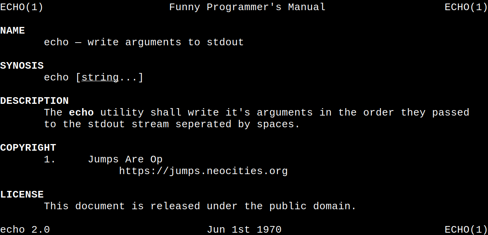

# Text2Man,  *The man-page converter.*

It's as simple as `./text2man mymanpage.t2m >mymanpage.1`.

Here's an example Text2Man file:
```
ECHO(1)   Funny Programmer's Manual   ECHO(1)

NAME
	echo - write arguments to stdout

SYNOSIS
	echo [|Ustring|R...]

DESCRIPTION
	The |Becho|R utility shall write it's arguments in the order they passed
	to the stdout stream seperated by spaces.

COPYRIGHT
	1. Jumps Are Op
		https://jumps.neocities.org

LICENSE
	This document is released under the public domain.

echo 2.0        Jun 1st 1970          ECHO(1)
```

Now after running `text2man echo.t2m >echo.1`
you can run `man ./echo.1` to view the generated man-page.

Here is the example man-page:


--------

## But, why? Just, why?
Good question.
